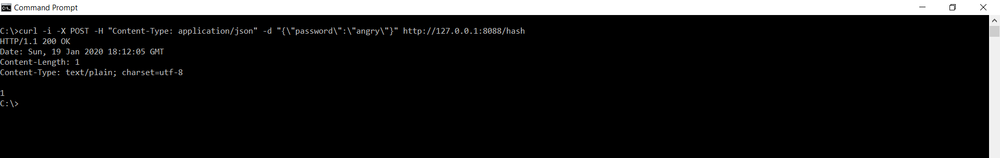

# [2] : Post Hash Request

## Description

A POST to /hash should accept a password.  It should return a job identifier immediately.  It should then wait 5 seconds and compute the password hash. The hashing algorithm should be SHA512.

### Precondition

The hash application should be listening at PORT 8088 and ready to accept curl requests.

### Assumptions

Hash application is running on a windows machine.
Curl is installed on the machine to send the request.

## Test Steps

1. Open Command Prompt
2. SET PORT=8088
3. Execute broken-hashserve_win.exe
4. Using curl application run the following command

curl -X POST -H "application/json" -d "{\"password\\":\"angrymonkey\"}" http://127.0.0.1:8088/hash

5. Ensure that the quotes inside the JSON object need an escape character for qutoes on a windows machine.  
 
  

## Expected Result

On successful application, the curl should return a hash identifier. If it is the first request, then the hash identifier should be 1. 

