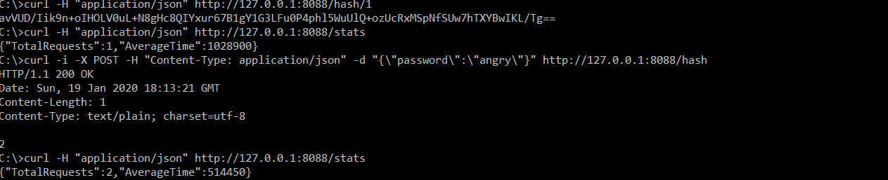

# [4] : Get Stats Request

## Description

A ​GET​ to ​/stats​ should accept no data.  It should return a JSON data structure for the total hash requests since the server started and the average time of a hash request in milliseconds.

### Precondition

1. The hash application should be listening at PORT 8088 and ready to accept curl request.
2. A POST has been submitted to the hash application, and it successfully returned a hash identifier. 

### Assumptions

Hash application is running on windows machine.
Curl is installed on the machine for sending request.

## Test Steps

1. Open Command Prompt
2. SET PORT=8088
3. Execute broken-hashserve_win.exe
4. Using curl application run the following command
curl -H "application/json" http://127.0.0.1:8088/stats

## Expected Result

The curl command should return API stats.  The response include Total Requests and Average Time.

