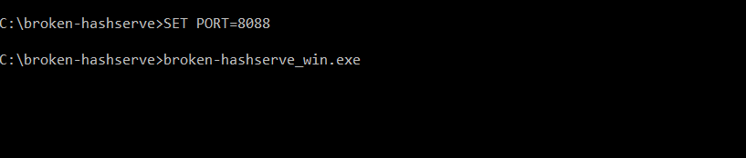

# [4] : Open the broken hashserve program

## Description

The broken hashserve program should listen for http connections when opened through command prompt. 

### Precondition

None

### Assumptions

Hash application is running on windows machine.
Curl is installed on the machine to send request.

## Test Steps

1. Open Command Prompt
2. SET PORT=8088
3. Execute broken-hashserve_win.exe
 
## Expected Result

On successful start, the application should wait for http connections 

  

